# 👋 Gwendal Boisard

**Full-Stack developer in training — Holberton School (Rennes)**  
Former retail manager (50+ team members) now building structured, scalable software with a systems mindset.

---

# 📅 Let’s Connect

Interested in discussing full-stack engineering, architecture, or internship opportunities?

---

# 🚀 Highlight Project

## 🏗 HBnB Evolution *(group project)*
Python • OOP • Layered Architecture • UML

- Entity modeling (User / Place / Review / Amenity)  
- Clear separation of concerns  
- Facade pattern implementation  
- API interaction flows & technical documentation  

👉 [Hbnb project](https://github.com/Antgst/holbertonschool-hbnb)

---

# 🧠 Core Focus

🔭 **Currently working on**  
Low-level systems programming in C and backend architecture foundations in Python.

🌱 **Currently learning**  
Advanced OOP, clean architecture principles, and progressing toward full web stack (HTML / CSS / JavaScript → React / Node).

🎯 **Looking for**  
Internship / apprenticeship in fullstack web development (Rennes or remote).

---

# 💻 Technical Foundations

<b>Next (in progress)</b>

---

# 📂 Systems & Programming Projects

<b>🖥 Systems Programming (C)</b>

**Simple Shell** – process handling, parsing, memory discipline  
👉 [Simple shell project](https://github.com/juliangf94/holbertonschool-simple_shell)

**_printf** – variadic functions & format parsing  
👉 [Printf project](https://github.com/Gwendal-B/holbertonschool-printf)

**Sorting Algorithms & Big O** – complexity analysis  
👉 [Sorting algorithms project](https://github.com/Gwendal-B/holbertonschool-sorting_algorithms)

<b>🐍 Python</b>

**Higher Level Programming** – data structures, OOP, abstraction  
👉 [Higher level programming](https://github.com/Gwendal-B/holbertonschool-higher_level_programming)

**ChatGPT Introduction** – debugging & structured documentation  
👉 [ChatGPT introduction](https://github.com/Gwendal-B/holbertonschool-chatgpt-introduction)

<b>🛠 Shell & Tooling</b>

**Shell Basics**  
👉 [Shell](https://github.com/Gwendal-B/holbertonschool-shell)

**Git Intro**  
👉 [Git intro](https://github.com/Gwendal-B/git-intro)

---

# 🏅 Certifications

<b>View certifications</b>

  
  &nbsp;&nbsp;
  
  &nbsp;&nbsp;

---

# 📈 GitHub

<b>Stats & Activity</b>

  
  

---

# 🌐 Contact

  
  

